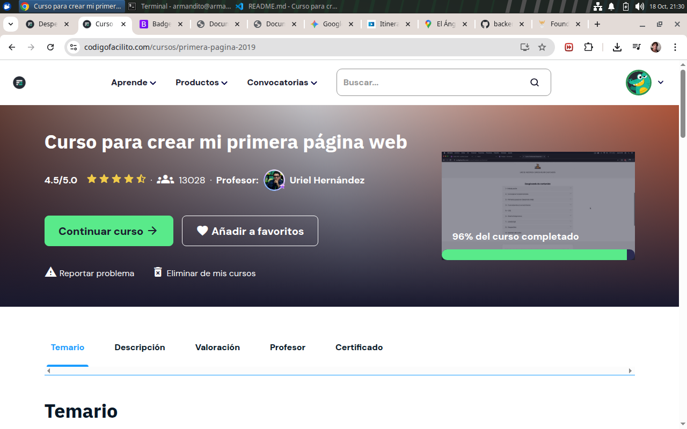
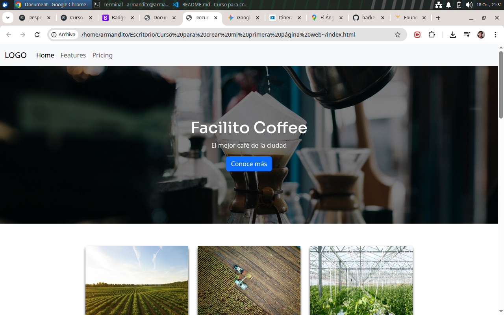

# [Curso para crear mi primera página web](https://codigofacilito.com/cursos/primera-pagina-2019)

## FacilitoCoffee

Se tomó el curso para reforzar los conocimientos de html y css de la primera parte de [The Odín Project](https://www.theodinproject.com/dashboard), en la parte de [FOundations](https://www.theodinproject.com/paths/foundations/courses/foundations).

Se aprendió
- Bootstrap 5
- Animación
- Iframes
- Formularios
- Flex
- html